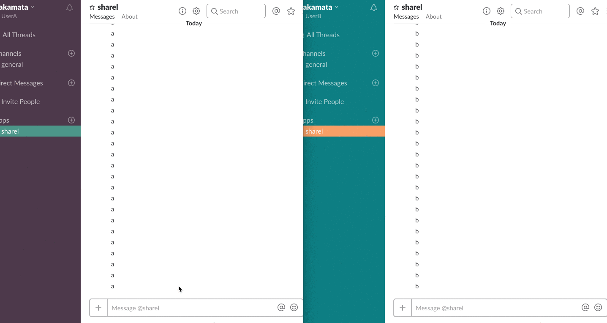

Sharel
====
SharelはSlack上に作ったTwitterのようなコミュニケーションツールです。
WEB+DB PRESS 101号のSlack特集の解説のため主要機能に絞って実装しています。  
（※実際のSharelはGitHubで公開していません）

## 概要
SharelはBot開発フレームワークであるBotkitをベースに作られたSlack Appです。
Sharelに対するダイレクトメッセージをフォロワーに転送することができます。
また、Slash Commandsでメニューを表示し、登録・退会・フォロー設定等を行います。



## 動作環境
 - Node.js(v6.3.0以上)
 - npm
 - ngrok

## インストール方法
Slack AppとしてSharelの動作確認を行うための必要最低限の手順です。

### ngrokをインストールして起動
SharelはSlackから一部のイベントを取得するためSSL/TLS対応のサーバを利用しています。
SSL/TLS対応のサーバ構築の手順を簡略化するためngrokを利用します。

```
# ngrokのzipをhttps://ngrok.com/downloadよりダウンロードして解凍
$ unzip /path/to/ngrok.zip
・・・
$ ngrok http 3000
```

### Slack AppにSharelを登録
Slack Appを作成し以下の機能を[Slack App登録画面](https://api.slack.com/apps)から設定します。
 - メニュー表示するための「Slash Commands」
 - ボタン付きメッセージを利用するための「Interactive Messages」
 - RTM APIの利用とBotとのDirect Messageを利用するための「Bot Users」
 
### Sharelのソースコードを取得
```
git clone git@github.com:hakamata-rui/sharel.git
```

### 必要モジュールのインストール
```
npm install
```

### Sharelの起動及びチームへのインストール
Botkitを起動してhttps://${ngrokで割り当てられたドメイン}/loginからSharelをチームにインストールします。
```
PORT=3000 CLIENT_ID=xxxxx CLIENT_SECRET=xxxxx node index.js
```

## Contribution
masterブランチのソースコードは大幅に変更することができないためバグ修正のみ受け付けます。  
Sharelに新機能や機能改善を行っていただける場合はdevelopブランチにお願いします。  

## Licence

MIT

## Author

[hakamata-rui](https://github.com/hakamata-rui)
